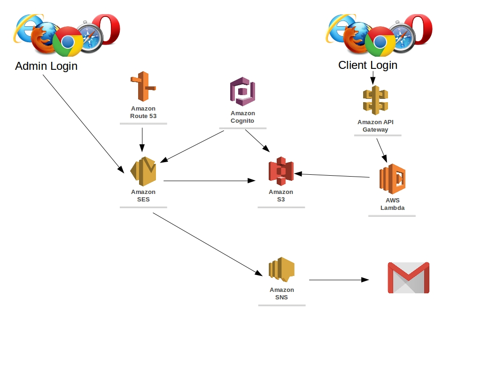

# Simple Email Server

This project uses AWS services and creates a simple email server for anyone. The code here allows you to bring up your email server on Cloud (AWS), manage email addresses and monitor the emails. All you need is AWS account and follow the instructions to get your server going.

## Installation instructions

Prerequisites
- AWS CLI installed with correct credentials which has access to 
    - S3
    - Route 53
    - AWS simple email service (SES)
    - AWS simple notification service (SNS)

- run the command which will ask for the following info
    - domain name
    - s3 bucket name
    - registered email addresses and forward address in a csv file
    - (optional) notification email address

- It will return the following info
    - SMTP address with user name and password
    - list of emails that are created 

## Requirements and Design

- Application should create an SES domain from input
- Application should set the following records at Amazon Route 53
    - MX for domain
    - TXT for verification
    - CNAME for DKIM
- Application should provide SMTP settings through generation of IAM role
- Application should store all the received emails to a private S3 bucket
- Application should allow to set up incoming email addresses and where they should be forwarded.
- Application should provide a set up for notifications for email receival
- Application should provide a Client Web user interface for logging into user's mail box. 
    - This mailbox should stored in S3 and can only be accessed by the Cognito user login.
    - Mails are rendered for readibilty
    - Meta information should be easily accesable from web interface
    - Attachment can be downloaded
- Application could provide a Admin Web User interface to show some statistics for email domain
    - Number of email's sent
    - Number of Bounces
    - Number of complaints

Architecture can be found 

## Legal

This repository is maintained by Melbourne "AWS Programming and Tools Meetup" at https://www.meetup.com/Melbourne-AWS-Programming-and-Tools-Meetup/. This repository is protected under MIT Licence which can be found at https://opensource.org/licenses/MIT and repeated below

Copyright (c) <2018> <AWS Programming and Tools Meetup>

Permission is hereby granted, free of charge, to any person obtaining a copy
of this software and associated documentation files (the "Software"), to deal
in the Software without restriction, including without limitation the rights
to use, copy, modify, merge, publish, distribute, sublicense, and/or sell
copies of the Software, and to permit persons to whom the Software is
furnished to do so, subject to the following conditions:

The above copyright notice and this permission notice shall be included in all
copies or substantial portions of the Software.

THE SOFTWARE IS PROVIDED "AS IS", WITHOUT WARRANTY OF ANY KIND, EXPRESS OR
IMPLIED, INCLUDING BUT NOT LIMITED TO THE WARRANTIES OF MERCHANTABILITY,
FITNESS FOR A PARTICULAR PURPOSE AND NONINFRINGEMENT. IN NO EVENT SHALL THE
AUTHORS OR COPYRIGHT HOLDERS BE LIABLE FOR ANY CLAIM, DAMAGES OR OTHER
LIABILITY, WHETHER IN AN ACTION OF CONTRACT, TORT OR OTHERWISE, ARISING FROM,
OUT OF OR IN CONNECTION WITH THE SOFTWARE OR THE USE OR OTHER DEALINGS IN THE
SOFTWARE.
